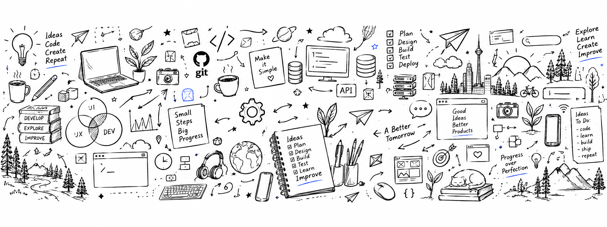

  

# Hi, I'm Mădălin 👋

I'm a developer focused on building **simple, thoughtful and useful web experiences**.

I enjoy creating lightweight web applications, experimenting with new ideas, and turning them into clean, maintainable products.

### Currently building

Personal web applications and open-source projects, with a focus on simplicity, usability and maintainable architecture.

### Building with

`PHP` · `JavaScript` · `React` · `HTML` · `CSS` · `SQLite` · `MySQL`

### Support my work ☕

If you enjoy my open-source projects, you can support their continued development. Contributions are entirely voluntary and don't provide access to additional products or services.

[Support on Ko-fi →](https://ko-fi.com/madalinmariusstan)

### Find me

🌐 [madalinmariusstan.dev](https://madalinmariusstan.dev)

---

*Build simple. Make it useful.*
